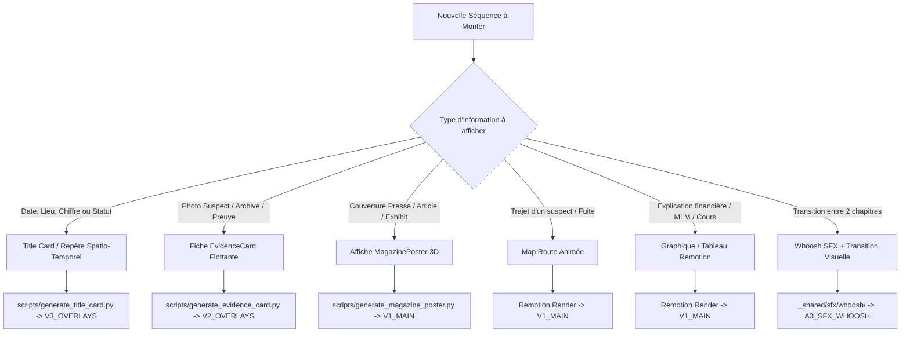

# 📦 Bibliothèque des Composants Réutilisables — Financial Forensics

Ce dossier recense l'ensemble des **composants modulaires, générateurs et templates réutilisables** pour la production des vidéos de la chaîne YouTube *Financial Forensics*.

Chaque composant est conçu pour être invoqué en **1 seule commande** ou importé dans les pipelines de montage automatisés (OTIO / Remotion / Kdenlive).

> [!TIP]
> 🗺️ **Feuille de Route & Prochains Composants :** Consultez la [Roadmap & TODOs des Composants Signature](ROADMAP_TODOS.md) pour les spécifications des futurs outils en cours de développement (*Document Highlighter*, *Status Stamp*, *Money Trail*, *Loss Odometer*...).

---

## 🗂️ Catalogue des Composants Réutilisables

| Composant | Description | Dans quel cas l'utiliser ? | Lien Documentation |
|---|---|---|---|
| **Title Card / Repères Spatio-Temporels** | Cartes de date, lieu, chiffres chocs avec typographie lourde sans cadre, transparence ProRes 4444 et son clavier synchronisé. | 🔹 Changement de date / lieu 🔹 Annonce d'un chiffre clé ou montant 🔹 Badge statut / dossier d'enquête | [Documentation Title Card](title-card/README.md) |
| **Grand Titre d'Épisode (MainTitle)** | Séquence monumentale de titre de la vidéo sur fond sombre cinéma immersif avec typographie gravée or, lueur dorée et travelling lent. | 🔹 Révélation du grand titre de la vidéo (fin du Hook) 🔹 Transition majeure Hook → Histoire 🔹 Billboard identitaire de l'épisode | [Documentation MainTitle](main-title/README.md) |
| **Titres de Chapitres & d'Actes (ChapterCard)** | Titres de parties et chapitres avec grand numéro en or, séparateur vertical, typographie blanche et transparence totale. | 🔹 Lancement d'une nouvelle partie / acte 🔹 Titre de séquence d'enquête 🔹 Transition narrative dans le récit | [Documentation ChapterCard](chapter-card/README.md) |
| **Fidélisation / Call-To-Action (SubscribeCTA)** | Animation d'engagement YouTube (Like, S'abonner, Cloche) avec curseur réactif, ondes de choc, vibration et audio SFX. | 🔹 Appel à l'action en milieu de vidéo (Mid-roll) 🔹 Conversion abonnés en fin d'épisode (Outro) 🔹 Superposition transparente sur n'importe quel plan | [Documentation SubscribeCTA](subscribe-cta/README.md) |
| **Fiche Personnage / Preuve (EvidenceCard)** | Photo d'archive / suspect flottante sans cadre (`clean`), tirage papier ivoire (`print`) ou bords doux fondus (`soft`), ombre cinéma, micro-dérive organique et déclencheur caméra iPhone calé frame 0. | 🔹 Présentation d'un suspect / personnage réel 🔹 Photo de bâtiment ou lieu d'archive 🔹 Pièce à conviction / document d'enquête | [Documentation EvidenceCard](evidence-card/README.md) |
| **Affiches, Couvertures & Articles (MagazinePoster)** | Mise en scène 3D d'articles de presse, couvertures de magazines sur fond bleu dégradé animé, particules, reflet papier glacé et son whoosh. | 🔹 Couverture de magazine de presse (*Forbes*, etc.) 🔹 Article de presse d'investigation ou publi-reportage 🔹 Exhibit d'archive et preuve médiatique | [Documentation MagazinePoster](magazine-poster/README.md) |
| **Document 3D & Caméra Virtuelle (Forensic3DDocument)** | Pièce à conviction ou dossier d'archives flottant en apesanteur 3D avec biseau papier, reflets de lumière spéculaire et travelling caméra lent. | 🔹 Présentation d'un document clé / bilan fuité 🔹 Pièce à conviction en perspective cinématographique 🔹 Décor 3D immersif ou overlay alpha ProRes 4444 | [Documentation Forensic3DDocument](forensic-3d-document/README.md) |
| **Coupe Schématique 3D (Forensic Cross-Section)** | Diorama en coupe transversale (sol, rue, bâtiments, tunnel clandestin néon cyan, piliers de fondation et repères HUD). | 🔹 Visualisation d'un braquage / tunnel souterrain 🔹 Coupe technique de bâtiment ou coffre-fort 🔹 Schéma d'infiltration ou de fuite | [Documentation Cross-Section](cross-section/README.md) |
| **Perforation Souterraine (Tunnel Drilling & Breach)** | Scène d'effraction dramatique (ouvrier en silhouette, perforateur SDS, débris 3D, radar HUD et secousses caméra). | 🔹 Percement du coffre-fort / tunnel 🔹 Séquence de tension d'enquête souterraine 🔹 Effraction mécanique ou cambriolage | [Documentation Tunnel Drilling](tunnel-drilling/README.md) |
| **Surlignage & Déclassification (DocumentEvidence)** | Pièce judiciaire, note ou email secret avec surlignage feutre or animé de gauche à droite ou levée de censure. | 🔹 Citation d'un email compromettant 🔹 Révélation d'une clause ou phrase choc 🔹 Déclassification d'une pièce secrète | [Documentation DocumentEvidence](document-evidence/README.md) |
| **Tampon Médico-Légal (StatusStamp)** | Tampon percutant (*ARRESTED*, *GUILTY*, *CONFIDENTIAL*) avec physique d'écrasement, onde de choc et micro-rebond. | 🔹 Inculpation / arrestation d'un suspect 🔹 Marquage de statut sur un document 🔹 Impact narratif de fin d'enquête | [Documentation StatusStamp](status-stamp/README.md) |
| **Affiche de Titre Signature (LedgerTitleCard)** | Billboard post-hook officiel *The Ledger* : bureau d'archives d'enquête, polaroids/exhibits, notes manuscrites à l'encre cursive, boîte de titre monumentale et tampon officiel. | 🔹 Billboard d'ouverture post-hook de chaque épisode 🔹 Identification officielle de la chaîne *The Ledger* 🔹 Transition cinématographique vers l'Acte 1 | [Documentation LedgerTitleCard](ledger-title/README.md) |
| **Séquence de Titre Animée en 3 Temps (LedgerTitleSequence)** | Séquence animée dynamique en 3 actes (Le Dossier ➔ Le Suspect ➔ Le Billboard officiel The Ledger avec éclair cyan et particules). | 🔹 Ouverture post-hook cinématographique de grand format 🔹 Présentation du dossier et de la cible en mouvement 🔹 Révélation d'impact de l'identité de marque | [Documentation LedgerTitleSequence](ledger-title-sequence/README.md) |
| **Banque SFX Signature** | Bibliothèque de bruitages identitaires (whooshes cinématiques, touches mécaniques, déclencheur photo iPhone, beat stabs). | 🔹 Transitions de scènes (Whoosh) 🔹 Effets d'apparition de documents (Typing) 🔹 Déclencheur photo (Shutter) | `_shared/sfx/` |
| **Cartes Animées de Trajets (Map Route)** | Cartes vectorielles avec tracé d'itinéraire animé (ex: Sofia → Athènes, flux de capitaux internationaux). | 🔹 Déplacements d'un suspect 🔹 Trajets de fuite ou vols d'avions 🔹 Circuits financiers multi-pays | `financial-forensics/src/compositions/` |
| **Comparateurs Financiers & Graphiques** | Graphiques animés de cours (OneCoin vs Bitcoin, FTX vs BTC, pyramide MLM, flux d'argent). | 🔹 Explication d'une fraude pyramidale 🔹 Confrontation cours réel vs cours artificiel 🔹 Statistiques et chronologies | `financial-forensics/src/compositions/` |

---

## 🧭 Matrice de Décision : Quel composant utiliser selon la situation ?

---

## ⚙️ Normes Globales pour les Composants

1. **Transparence Native (Canal Alpha)** :
   * Les overlays doivent être exportés en **Apple ProRes 4444** (`yuva444p10le` ou `yuva444p12le`) ou en **WebM VP9 avec Alpha** (`yuva420p`).
   * Aucun fond artificiel ou cadre "IA" qui obstrue la vidéo sous-jacente.
2. **Audio Calé, Net & Signature "Beat-Through"** :
   * Les effets sonores (clavier machine à écrire, obturateur photo) doivent être nets, tranchants et calés dès la frame 0.
   * Lors du Grand Titre, la narration fait une pause solennelle, mais la musique sur `A2_MUSIC_BED` **continue sans interruption**, portée par le whoosh pur sur `A3_SFX_WHOOSH` (aucun grondement ni drone sourd).
3. **Piste de destination standardisée (Topologie Chaîne)** :
   * **`V3_TITLES`** (Sommet) : Title Cards (lieux, dates), chiffres clés ($5M), animations vectorielles.
   * **`V2_OVERLAYS`** (Milieu) : Cartes de Chapitres (`chapter_*.mov`) et Fiches Suspects (`card_*_soft.mov`).
   * **`V1_MAIN`** (Fondation) : Piste maîtresse continue (rushs d'archives, B-roll, et le clip du Grand Titre en pleine largeur).
   * **`A1_MASTER_VOICE`** : Voix off principale (avec respiration narrative au Grand Titre).
   * **`A2_MUSIC_BED`** : Musique de fond continue.
   * **`A3_SFX_WHOOSH`** : Bruitages d'impact (whoosh titre, déclencheur photo, clics clavier).
   * **`A4_SECONDARY_AUDIO`** : Archives sonores, interviews, son direct des rushs.

---

## 🔗 Liens Utiles
* [Inventaire technique et chemins des outils](../outils.md)
* [Spécifications du pipeline OTIO](../PIPELINE_OTIO.md)
